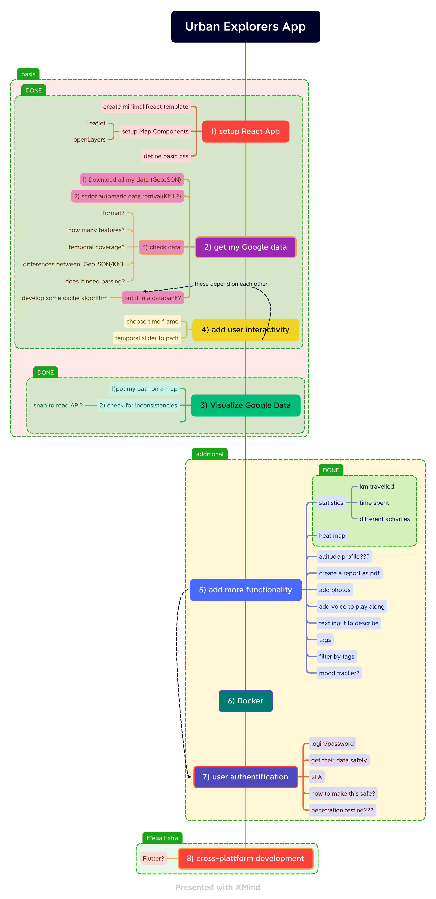
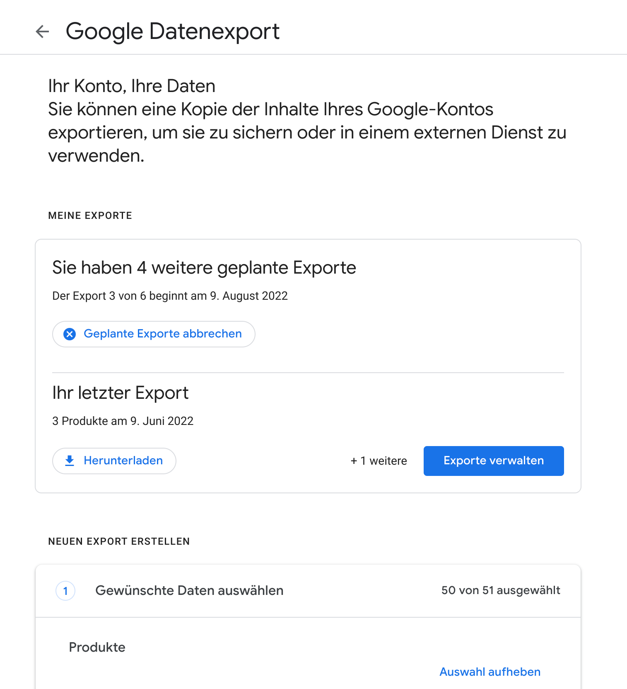
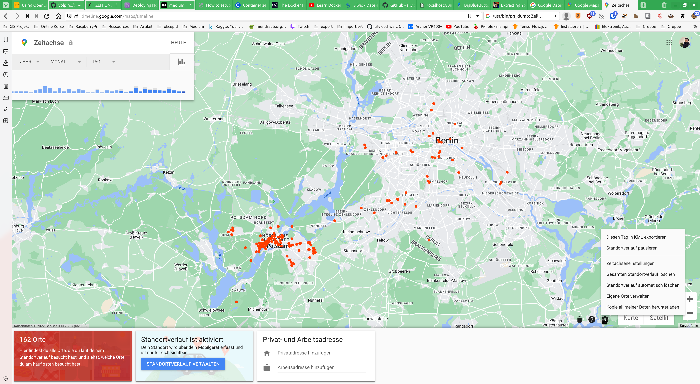
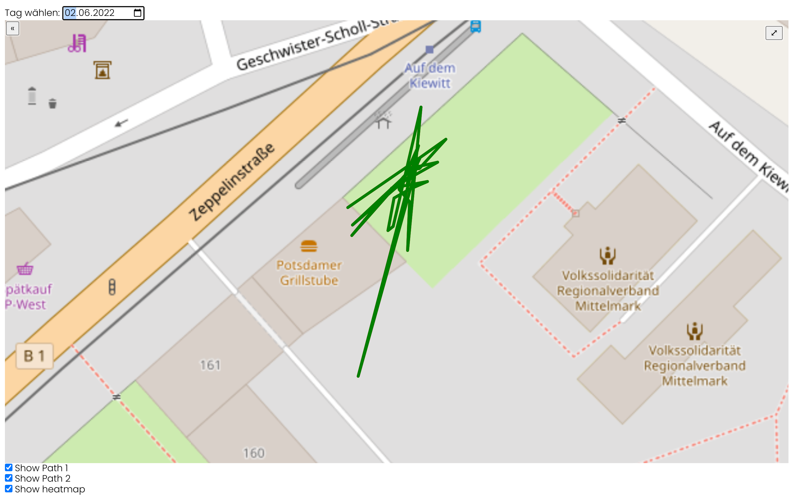

---
# Infos
title: Urban Explorers
subtitle: Eine PERN Anwendung zur Visualisierung von Google Standortverlauf
author: Silvio Schwarz
date: \today
abstract: Im Rahmen der Weiterbildung GIS und Webmapping wurde eine Webanwendung erstellt, mit deren Hilfe der persönliche Google Standortverlauf dargestellt werden kann. Dabei wurde der PERN (PostgreSQL, Express, React, Node) Stack verwendet. Mit React wurden verschiedene Komponenten der Webseite erstellt. Diese greifen über einen Express Server auf eine PostgreSQL Datenbank zu, in der Tabellen des täglichen Standortverlaufs gespeichert sind.
numbersections: true
lang: de-DE

# Format
fontsize: 12pt
linestretch: 1.5
mainfont: "Ubuntu"
sansfont: "Roboto Condensed"
monofont: "Ubuntu Mono"
mathfont:
geometry: a4paper, left=25mm, right=20mm, top=20mm, bottom=20mm
documentclass: scrartcl
linkcolor: blue
colorlinks: true
...


\pagenumbering{gobble}
\pagebreak
\pagenumbering{Roman}
\tableofcontents
\pagebreak
\pagenumbering{arabic}
\setcounter{page}{1}

# Einleitung

Im Rahmen der Projektphase in der Weiterbildung "GIS und Webmapping" wurde eine Webanwendung zur Darstellung des Google Standortverlaufs erstellt. Dafür wurde auf den Fullstack PERN (PostgreSQL, Express, React, Node) zurückgegriffen. Der Verlauf ist in der folgender Grafik einzusehen.

Ausgangpunkt war der Krankenhausaufenthalt einer Freundin. Durch immer noch geltende Corona Maßgaben war weder ein Besuch noch ein Verlassen der Station möglich. Die Urban Explorers App sollte ein Weg sein, wie ich meine Freundin dennoch an meinen Streifzügen durch die Natur und Umgebung von Potsdam und Berlin teilhaben lassen kann und Eindrücke und Kuriositäten auf dem Weg mitteilen. Davon ist die App noch ein ganzes Stück entfernt und meine Freundin auch schon eine ganze Weile entlassen. 

Inspiration für die Urban Explorers App fand ich in Anwendungen maschinellem Lernens zur Identifikation von Vogelgesang namentlich der [BirdNET](https://github.com/kahst/BirdNET-Analyzer) App des Cornell Lab of Ornithology und der TU Chemnitz.

\pagebreak


# Server

## Express Server

Um die Daten im GeoJSON-Format aus der PostgrSQL Datenbank zu benutzen, wurde ein Express Server programmiert. Somit ist es möglich verschiedene Routen zu definieren.
Unter "localhost:4000/getGeoJSON" werden mittels entsprechenden SQL Query alle Geometrien in der Datenbank zurückgegeben. "localhost:4000/getGeoJSON/2022-05-06" gibt dagegen nur den Eintrag für den 06.05.2022 zurück.

```javascript
app.get("/getGeoJSON", async (req, res) => {
  try {
    const geoJSONData = await pool.query(QUERY);
    res.json(geoJSONData.rows);
  } catch (err) {
    console.error(err.message);
  }
});
```

Über das Node Modul pg wird eine Verbindung zum PostgreSQL Server hergestellt.
Es wurde somit ein REST (Representational State Transfer) API aufgesetzt., die mittels http zwischen Client und Server kommuniziert.


## PostgreSQL Datenbank

Die Daten für die einzelnen Tage wurden als  KML heruntergeladen.

Mittels:
```bash
#! /bin/sh
for FILE in ./*.kml; do
  echo "${FILE%.*}"
  togeojson "${FILE}" > "${FILE%.*}".geojson
  ogr2ogr -f "PostgreSQL" PG:"dbname=testdb user=postgres password=postgres"
  "${FILE%.*}".geojson
done
mv *.geojson ../GeoJSON/
```

konnte eine Batchverarbeitung aller KML Dateien erfolgen. Diese wurden zuerst in GeoJSON umgewandelt (warum eigentlich?) und dann über OGR der PostgreSQL Datenbank als Tabelle hinzugefügt.

# Client

[React](https://reactjs.org) ist ein eine JavaScript Bibliothek zur Erstellung von User Interfaces. Entwickelt von Facebook erweitert React JavaScript um JSX (JavaScript Syntax Extension), wo mit es möglich wird eigenle HTML-Elemente zu definieren, sogenannte Komponenten. Das besondere an React ist, dass eine virtual DOM erstellt und gerendert wird. Dadurch ergeben sich viele Vorteile. So ist es möglich mit React einen "State" zu definieren und aktualisieren. Somit lassen sich "reaktive" (daher auch der Name React) Komponenten erstellen, die bei Veränderungen neu gerendert werden. Ein weiterer Vorteil von React ist, dass "it's just JavaScript". Es werden also keinerlei neuen Programmiersprachen benötig und passt deswegen hervorragend in den PERN Stack, da auch Express und Node "just JavaScript" sind.

Die einzelnen Openlayers React Komponenten bauen auf dem Repository:
[Openlayers-react-map von Michael Brown](https://github.com/mbrown3321/openlayers-react-map) auf. Es existieren zwar auch Node Module wie openlayers-react, jedoch ist Einarbeitung umfangreich und für weitgehende Kontrolle muss man die Komponenten doch wieder selbst anpassen.

Die Urban Explorer Anwendung gliedert sich zu erst in die 3 Komponenten Navbar, Main und Footer. Allerdings dienen diese nur zur Strukturierung undals Platzhalter für zukünftige Funktionen. Innerhalb der Main Komponente sind die 3 Komponenten Map, Heatmap und Statistics untergebracht.

Schematischer Aufbau der Main Komponente:
Zuerst werden die Unterkomponenten MapOpenLayers, Statistics und Heatmap importiert. Danach wird die funktionelle Komponente Main definiert. Es werden Variablen, wie der Port des Express Servers und States, wie ob eine Layer sichtbar oder nicht ist gesetzt. React.useEffect kümmert sich dann um alle Funktionsaufrufe, wie das Ändern derSichtbarkeit einer Layer nach einem Klick oder das Laden der Daten. Am Ende wird im return Statement die Struktur der Komponente definiert, wie sie gerendert werden soll. Dabei werden einzelne Variablen wie die darzustellenden Daten an die Unterkomponenten mittels Properties übergeben.

\pagebreak
```javascript
import React from "react";
import MapOpenLayers from "./openLayers/MapOpenLayers";
import Statistics from "./Statistics";
import Heatmap from "./openLayers/Heatmap";

export default function Main() {
  const port = 4000;
  const [showLayer, setShowLayer] = React.useState(true);
  
  React.useEffect(() => {
    setShowLayer((prevState) => !prevState);
    fetch(`http://localhost:${port}/getGeoJSON/${datum}`)
    setShowLayer((prevState) => !prevState);
  }, [datum]);

  return (
    <main>
      <p>Main Content</p>
      <div className="main-content">
        <MapOpenLayers data={geoJSONObject} />
        <aside>
          {showLayer && (<Heatmap showLayer={showLayer} data={geoJSONObject}/>)}
          <Statistics data={geoJSONObject} />
        </aside>
      </div>
      <div>
        <input type="checkbox" checked={showLayer} 
        onChange={(event) => setShowLayer3(event.target.checked)}
        />{" "}
        Show heatmap
      </div>
    </main>
  );
}
```


## Map

Die Komponente MapOpenLayers zeichnet eine Openstreetmap Karte als Hintergrund und eine zuschaltbare Vektorlayer der Daten für das ausgewählte Datum. Des Weiteren gibt es die Möglichkeit eine Übersichtskarte hinzuzuschalten und die Karte auf Vollbild zu vergrößern. Das Zentrum und die Ausdehnung der Karte wird aus den GeoJSON Daten des Vektorlayers berechnet. Zur Berechnung des Zentroids wird [TurfJS](https://turfjs.org) genutzt.

Da sich nicht einfach nur die Daten des Vektorlayers aktualisieren lassen, wird ein kleiner Trick benutzt, um neue Daten darzustellen. Innerhalb der fetch Operation wird der Status von showLayer auf false und nach dem Laden der Daten wieder true gesetzt. Das hat zur Folge, dass der Vektorlayervon der Grundkarte entfernt und mit den aktuellen Daten wieder hinzugefügt wird.

Die zweite Checkbox "show Path" ist aktuell noch experimentell. Gedacht war, nicht das komplette GeoJSON darzustellen, sondern mittels eines Sliders den zeitlichen Verlauf darzustellen.

## Statistics

Die Statistics Komponente stellt ein paar der grundlegenden Daten aus der GeoJSON Datei zusammenfassend dar. Für den ausgewählten Tag, werden zurückgelegt Distanz, Zeit der Bewegung und die daraus abzuleitende Durchschnittsgeschwindigkeit berechnet.

Außerdem werden weitere Elemente in den properties der Datei als Stationen mit Name, Dauer, Distance und Durchschnittsgeschwindigkeit zurückgegeben.

Da die Daten ein "State" der Variable geoJSONObject sind, aktualisiert sich die Statistics Komponente, sobald neue Daten geladen werden.

## Heatmap

Die Heatmap Komponente soll eine Übersicht über häufig besuchte Orte geben. Aktuell wird hierbei auf die Punktdaten aus dem GeoJSON zurückgegriffen. Diese stellen meist Orte dar, wo ein Ende einer Bewegung und längeres Verweilen festgestellt wurde. Zur Berechnung des Zentrums der Heatmap dient auch hier wieder die centroid Funktion von [TurfJS](https://turfjs.org).

# Probleme

## Daten von Google bekommen

Google bietet kein (bzw nicht mehr, da es mal Latitude gab) API um seine Standortdaten zu erhalten. Was es gibt ist Google-Takeout, mit dem man einstellen kann, welche seiner Daten in regelmäßigen Abständen per Email Oder direkt zu Drive geschickt werden sollen.



Darüber hinaus ist es möglich über Google Maps "Meine Zeitachse" eine KML Datei eines einzelnen Tages herunterzuladen.



Um diese Möglichkeit jedoch programmatisch ausnutzen zu können, braucht man die Cookie Datei seiner letzten Session auf Google. Vergleiche dazu auch [Extracting Your Own Location Information From Google - The Hard](https://shkspr.mobi/blog/2014/04/extracting-your-own-location-information-from-google-the-hard-way/) von Terence Eden, der ein solches Vorgehen schon im April 2014 umgesetzt hat.

Im Rahmen des Projekts lagen die Prioritäten nicht auf dem Webscraping von Google Diensten.

## Parsen der Daten aus der PostgreSQL Datenbank

Da die Daten per ogr zu PostgreSQL hinzugefügt werden, wird für jeden neuen Tag eine neue Tabelle der Datenbank hinzugefügt. Dies führt zu einigen Problemen. So muss im Express Server der Tabellenname für jedes neue Datum dynamisch in den SQL Query übergeben werden. Dies geschieht mittels eines Template-Strings
```javascript
psqlQuery3 += "FROM public.history_";
psqlQuery3 += `${date.replace(/-/g, "_")}`;
```
welcher nicht gegen SQL Injection gesichert ist. Eine Möglichkeit wäre die Verwendung einen "tagged template strings"
```javascript
psqlQuery3 += "FROM public.history_";
psqlQuery3 += sql`${date.replace(/-/g, "_")}`;
```
allerdings überstieg die genaue Implementierung den Rahmen des Projekts.

Desweiteren werden die Tags im KML nur bis zu einer gewissen Tiefe umgewandelt, was zur Folge hat, dass die timespan als String in PostgreSQL gespeichert wird, anstatt die darin enthaltene begin und end als einzelne Properties zu speichern. Wahrscheinlich ließe sich ein besserer KML Parser erstellen. In diesem  Projekt wurde  eine weniger elegante Lösung genommen:

```javascript
let timespan = feature.properties.timespan;
let parsed = timespan.toString().split(",");
const [begin, end] = parsed.map((item) => {
      return new Date(item.split('"')[3]);
    });
```

## zeitliche Datenauflösung

Relativ schnell wurde im Projekt klar, dass der zeitliche Abstand mit dem Google standardmäßig Daten zum Standortverlauf speichert, sehr groß ist. Das hat zur Folge, dass Linien sehr lang sind und nicht den Wegen folgen, durch Häuser verlaufen und der Pfad viele spitze Wendungen hat. Zusehen ist dies in Daten zu Anfang Mai. Abhilfe konnte geschafften werden, in dem die navigation von Google Maps aktiviert wurde, sodass alle 15 Sekunden ein neuer Datenpunkt erzeugt wird.

## CSS

Teilweise veräbder sich das Layout oder werden Teile der Karten unvollständig dargestellt. Jedoch passiert dies nur bei manchen Daten und auch da ist kein Muster erkennbar. Der Schluss liegt nahe, dass es im CSS zu ungewollten WEchselwirkungen kommt. Allgemein bedarf  die Anwendung im jetzigen Zustand drigend einer Periode des Refactoring.

## Überflüssige Schritte

Die Umwandlung der KML Dateien in GeoJSON ist wohl nicht notwendig, da OGR auch KML verarbeiten kann. Auch das Lesen der Daten aus der Datenbank als GeoJSON ist wahrscheinlich umständlicher als es sein müsste.

# Ausblick

## Urban Explores App

Schon relativfrüh wurden die Limitierungen durch die Abhängigkeit von Google deutlich. Umständlicher Download und Konvertierung der Daten, eine zeitliche Abtastung, die mehr durch einen Hack verändert werden konnte und Einschränkung darin, welche Daten wie aufgezeichnet werden.

Deweswegen wäre es am besten eine eigene Urban Explorers App zu entwickeln, eine Progressive Webapp bietet sich hier an. Damit sollte die volle Kontrolle über die Daten bei den App-Entwicklern liegen und zusätzliche Funktione, wie Bilder, die man unterwegs mit seinem Smartphone gemacht hat, in die Karte zu integrieren, wesentlich vereinfachen. Auch lässt sich dann ein API bereitstellen, von dem die Daten auf einfacherem Wege erlangt werden können.

## Zeitleiste

Eine Funktion, die es leider nicht in das Endprodukt geschafft hat, ist ein Schieberegler, mit dem sich der zeitliche Verlauf des Pfades einstellen lässt. Auch eine Animation eines Markers entlang des Pfades ist vorstellbar und die ersten Bemühungen schon Teil der Anwendung.

## Einzelne Teilabschnitte darstellen

Aktuell werden im Statistik Teil nur einzelne Teilabschnitte aufgezählt. Es wäre wünschenswert eine Verbindung dieser Information zu Teilabschnitten des Pfades zu erstellen, um einen Zusammenhang herszustellen.

## Daten bereinigen

Wie bereits erwähnt, konnte die zeitliche Abtastung  nur mittels eines Tricks erhöht werden, sodass sich einige Artefakte in den Daten befinden. Beispielhaft dient hier der 02.06.2022:



## Zusätzliche Funktionen

Einige zusätzliche Funktionen wären wünschenswert. So zum Beispiel das Hinzufügen von geocodierten Bildern, denn es ist nicht wirklich eine Urban Exploration, wenn man seine  Funde von Unterwegs nicht belegen kann. Auch Funktionen wie ein Höhenverlauf wären denkbar, allerdings geben die Google Daten keine Höhe an. Hier könnte man einen Verschnitt des Pfades mit einem Digitalen Geländemodell vornehmen oder wie schon erwähnt, eine eigene App zum Datensammeln einsetzen.

Eine besondere Kategorie von Zusatzfunktionalität besteht in Methoden des maschinellem  Lernens. Anwendungen wie [BirdNET](https://github.com/kahst/BirdNET-Analyzer) des Cornell Lab of Ornithology und der TU Chemnitz zur Identifizierung von Vögeln durch das Aufnehmen und die Analyse von Vogelgesang oder Indentifizierung von Pflanzen durch die Verarbeitung von Fotos, wären eine qualitativ hochwertige Ergänzung und waren auch der eigentliche Auslöser/Ideengeber für dieses Projekt.

Zu letzt aber sicher nicht als unwichtigester Punkt sind noch Fragen der Sicherheit, User Management und Authentifizierung anzusprechen. Diese Funktionen gibt es bisher überhaupt nicht, wäre aber wünschenwert, wenn die Anwendung zu einer Multi-User Umgebung ausgebaut werden könnte.
